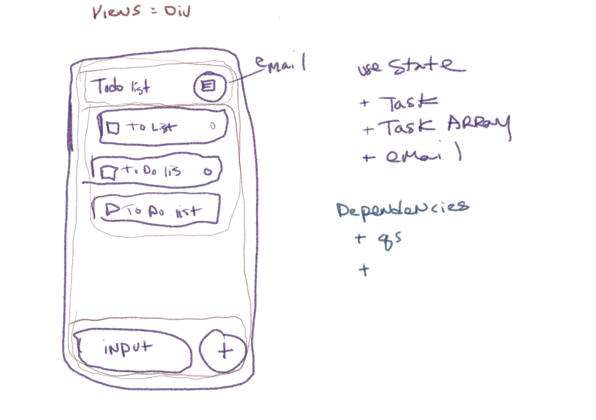

# React Native
# lab-41
## Author: Tek Jones

## Deployment and test
  * [test page](https://expo.dev/@tekthree/lab-react-native-app)
  * [deployment](exp://exp.host/@tekthree/lab-react-native-app) exp://exp.host/@tekthree/lab-react-native-app (doesn't seem to recognize this as a link )

## About
- Create your first native phone/device application using React Native, tapping into at least 2 phone features.

### How to Use App
  - This is a simple To-do app that lets you type out todo items and email it to yourself. 

  - To delete when complete just tap the todo item.

## Running the app
  * npm run android
  * expo start

## Test
* npm test

### Session 1
- Over the next 2 lab coding sessions, you will create your first Phone App. What it does and how it looks is up to you. This is an opportunity to play around with whats possible in React Native and to get a feel for how you can get into the various device features.
This is a 2-session assignment, after which you will live-demo your phone app to the class (at the start of class 43

### User Stories
- As a user I want to be able to type out my daily todos and see them displayed on a list
- As a user, when I am done with the todo, I want to be able to delete it from the list
- As a user I want to be able to send the list to my email

### Requirements
- Use at least 1 native device feature (Contacts, Camera, GPS, etc)
- High Fidelity Styling and UX
   - Good starting points:
     - Native Base
     - Builder X
- Properly Documented for End Users
- Live Demo & Presentation

## UML

